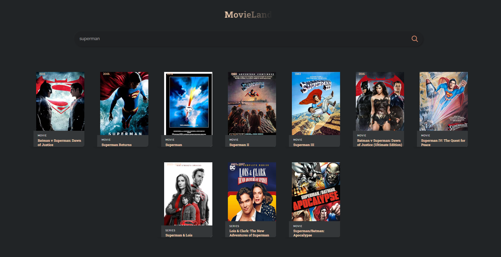

# 🎬 MovieLand

A simple React application to search and browse movies using the [OMDb API](https://www.omdbapi.com/).

---

## 🚀 Features

✅ Search movies by title  
✅ View posters, titles, years, and types  
✅ Responsive and clean UI  
✅ Environment variable for secure API key usage

---

## 🔧 Tech Stack

- **React** (Create React App)
- CSS
- OMDb API

---

## 📸 Screenshots




---

## 💻 Getting Started

To run this project locally:

1. **Clone the repo**

    ```bash
    git clone https://github.com/abhaymani421/Movie-Look-Up-Web-App
    cd movie_app
    ```

2. **Install dependencies**

    ```bash
    npm install
    ```

3. **Set up environment variables**

    Create a `.env` file in the root of your project:

    ```
    REACT_APP_OMDB_API_KEY=your_api_key_here
    ```

    Replace `your_api_key_here` with your OMDb API key.

4. **Start the app**

    ```bash
    npm start
    ```

    The app will be available locally at:

    ```
    http://localhost:3001
    ```


